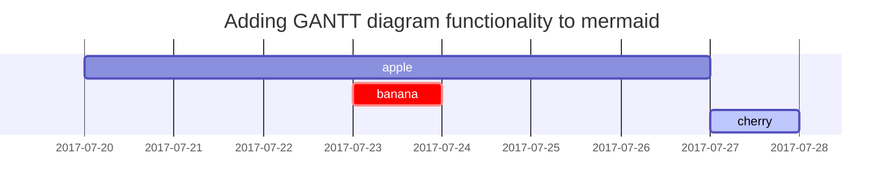

---
categories:
- 기타
- 테스트
date: 2024-09-26 17:14:51 +0900
math: true
mermaid: true
tags:
- blog
- chirpy
- github
- notion
- 자동화
title: '[테스트] 테스트 페이지 (Github Pages Chirpy)'
uid: 234
---

> 각각 아래 항목에 따라 정상 동작시 ✅, 불완전 동작은 ⚠️, 불가능은 ❌ 의 아이콘으로 표시하였음
{: .prompt-tip }

## Headings ✅

# H1 — heading ✅

## H2 — heading ✅

### H3 — heading ✅

### H4 — heading ❌

→ 노션은 H3까지 지원

## Paragraph ⚠️

→ 텍스트는 모두 잘 보이나 글씨 컬러, 배경색 등은 표시가 안 됨 (notion markdown 출력의 한계)

→ Bold, Italic, 취소선, 인라인 코드블럭은 정상 동작

Quisque egestas **convallis** ~~ipsum~~, ut sollicitudin *risus* tincidunt a. Maecenas `interdum` malesuada egestas. Duis consectetur porta risus, sit amet vulputate urna facilisis ac. Phasellus semper dui non purus ultrices sodales. Aliquam ante lorem, ornare a feugiat ac, finibus nec mauris. Vivamus ut tristique nisi. Sed vel leo vulputate, efficitur risus non, posuere mi. Nullam tincidunt bibendum rutrum. Proin commodo ornare sapien. Vivamus interdum diam sed sapien blandit, sit amet aliquam risus mattis. Nullam arcu turpis, mollis quis laoreet at, placerat id nibh. Suspendisse venenatis eros eros.

## Lists ✅

### Ordered list ✅

1. Firstly
2. Secondly
3. Thirdly

### Unordered list ✅

- Chapter
    - Section
        - Paragraph

### ToDo list ✅

- [ ]  Job
    - [x]  Step 1
    - [x]  Step 2
    - [ ]  Step 3

### Description list ✅

**Sun**

the star around which the earth orbits

**Moon**

the natural satellite of the earth, visible by reflected light from the sun

## Block Quote ✅

> This line shows the *block quote.*
> 

## Prompts ⚠️

→ callout 내용을 모두 prompt `tip` 으로 변경함

> An example showing the tip type prompt
{: .prompt-tip }


## Tables ⚠️

→ 테이블은 정상 출력하지만 안의 내용 중 줄바꿈이 있는 경우 인식 안됨 (추후 수정 예정)

| Company | Contact | Country |
| --- | --- | --- |
| Alfreds Futterkiste | Maria Anders | Germany |
| Island Trading | Helen Bennett | UK |
| Magazzini Alimentari Riuniti | Giovanni Rovelli | Italy |

| Column1 | Column2 |
| --- | --- |
| A | 1 |
| B | 2
3 |
| C | 2 |

## Links ✅

[https://127.0.0.1:4000](https://127.0.0.1:4000/)

## Footnote ❌

→ Footnote는 노션에서 구현 불가능

Click the hook will locate the footnote[1](https://jmjeon94.github.io/posts/test/#fn:footnote), and here is another footnote.

## Inline code ✅

This is an example of `Inline Code`.

## Filepath ✅

→ inline code로 대체

Here is the `/path/to/the/file.extend`

## Code blocks ✅

### Common ✅

```
This is a common code snippet, without syntax highlight and line number.
```

### Specific Language ✅

```bash
if [ $? -ne 0 ]; then
  echo "The command was not successful.";
  #do the needful / exit
fi;
```

### Specific filename ❌

→ 노션에서 파일명을 표기하는 것은 구현 불가능

```scss
@import
  "colors/light-typography",
  "colors/dark-typography";
```

## Mathematics ✅

→ front matter에서 math: true 설정 시 사용 가능

The mathematics powered by [**MathJax**](https://www.mathjax.org/):

(1)$∑_{n=1}^∞ 1/n^2=\dfrac{π^2}{6}$

We can reference the equation as (1).

When a≠0, there are two solutions to $ax^2+bx+c=0$ and they are

$x=\dfrac{−b±b2−4ac}{2a}$

## Mermaid SVG ✅

→ front matter에서 mermaid: true 설정 시 사용 가능



## Images ✅

### Default ✅


### Default (with caption) ⚠️

→ 노션 markdown의 caption이 plain text 형태로 출력되서 caption이 아닌 하위 텍스트로 출력됨 (추후 수정 예정)


이것은 이미지 캡션입니다.

## Reverse Footnote ❌

→ 노션에 풋노트 기능이 없음

1. The footnote source
2. The 2nd footnote source 

### Toggle List ❌

→ 일반 bullet list처럼 나옴 (내용은 항상 열려있음)

- 토글 목록 제목
    
    토글의 내용입니다.
    

### Border Line ✅

경계선 입니다.

---